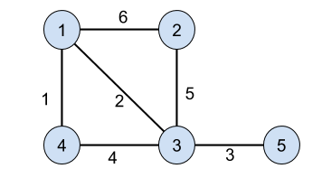
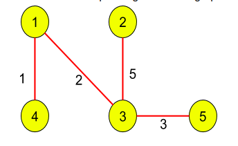

Total cycles in a complete graph:  
`C = (N-1)!/2`  
Total Spanning Tree:  
``  
More than 1 Minimum Spanning Tree if more than 1 edge exist between any two nodes  

# Prim's Algorithm
1. Find minimum edge weight and add it to your answer
2. Mark the vertices as visited 
3. Add the minimum edge weight of both the vertex
4. Check for cycle visited
5. Repeat the above till all the vertex are visited

